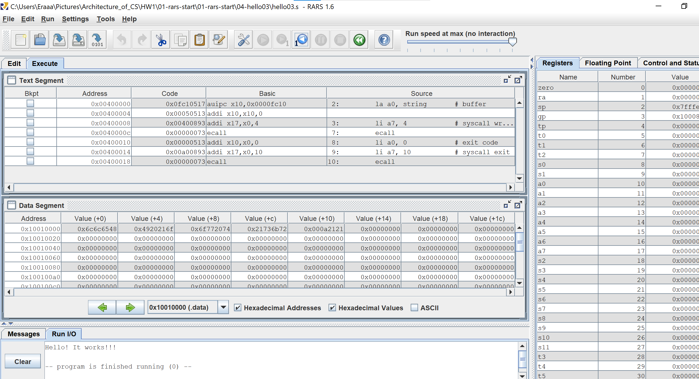

# Отчет

### Задача 1 (add-int01) + Типы форматов команд

На примере этой задачи разберем **типы форматов команд**.
Нажав на клавишу F3(запуск ассемблирования) и на кнопку Execute в эмуляторе, видно, как именно команды программы соответсвуют базовым ассемблерным командам в TextSegment.


Введя два числа в нижнее поле консоли, программа выдает результат суммы чисел и успешно завершается.

#### Типы форматов 
1.  ```li a7 5``` - Load Immediate (Аналогично ```li a7 1``` и ``` li a7 10```)
Эта команда (```addi```, так как  ```li``` это псевдокоманда исходя из поля Basic(см.скриншот)) соответсвует I-type (Immediate), так как она используется для загрузки непосредственного значения (в данном случае 5) в регистр (a7)

2.  ```ecall``` - Environment Call
Данная команда - команда системного вызова, которая не относится к какому-то конкретному типу. Но в данном случае, так как она следует за командой ```li``` и обращается к непосредственному значению, загруженному в регистр ```a7```, то ```ecall``` относится к I-type.

3.  ```add a0 t0 a0``` - Add
Поскольку это арифметическая команда, которая выполняет сложение между двумя регистрами, то она не включает в себя непосредственное значение и производит операции между двумя регистрами, значит соответствует формат R-type (Register/register).

4.  ```mv t0 a0```  
Это псевдокоманда и на этапе компиляции видно в столбцах Basic-Source ее соответствие команде ```add x5, x0,x10```, а то есть R-type (Register/register) формат

### Задача 2 (hello01.s)

Запустив программу, нажав клавишу F5 (предварительно проведя компиляцию с помощью F3 или знака ключа в верхней панели эмулятора), мы видим, что программа выводит в консоль "Hello! It works!!!\n". Обратившись к TextSegment (нажав на Execute) мы можем наблюдать, что сначала сохраняется адрес отметки ```string``` в регистр a0 (команда ```la```), затем происходит указание какой системный вызов должен исполнятся, посредством загрузки непосредственного значения 4 в регистр `a7` (команда ```li```), ```ecall```  осуществляет данный вызов и после него в консоль выводится строка. Далее использованный регистр (```a0```) обнуляется и указывается системный вызов окончания программы. 

### Задача 3 (hello02.s) + Псевдокоманды
. 
Обратившись к разделу помощи в эмуляторе (нажав на знак вопроса в верхней панели) и перейдя в Extended (Pseudo) Instructions , мы видим список псевдокоманд, на скриншоте видно, что в нем присутсвуют команы ```li```, ```la```, которые есть в коде программы hello02.s
Так, например, перейдя в Execute, нажав на соответсвующую кнопку в верхней части эмулятора, заметим, что в графе Basic (столбце отображения ассемблерного кода, который переведен в машинный) команде ```li a7, 4``` соответвует ```addi x17, x0, 4```(команде результата сложения с константой)
  
### Задача 4 (hello03.s)

 --> 

Воспользовавшись в данной программе режимом пошагового выполнения (нажав после ассемблирования не F5, а на значок заупска программы с "1" или F7), видно что строка "Hello! It works!!!\n", отображается в нижней консоли Run I/O только после вызова ```ecall``` (7 строка). Также данный режим позволяет заметить как поэтапно меняются значения регистров a0, a7, после команд ```li```, ```la``` в правом поле эмулятора Control and Status (Registers). 

### Задача 5 (hello-ru.s)


Так же в эмуляторе представлено поле Messages в нижней части, которое уведомляет о запуске программы, компиляции и об их успешном завершении либо ошибках во время выполнения или ассемблирования 

### Задача 6 (add-int02.s)
 
  
Данная задача была мною запущена в режиме автоматического выполнения, после введения 2 чисел в консоль ввода, была так же получена сумма двух чисел, как и в первой задаче. 

### Команды системных вызовов

Обратившись к системе помощи эмулятора, посредством нажатия на знак вопроса в верху можно определить какие команды являются командами системного вызова, обратившись к разделу Syscalls, мы можем видеть примеры таких команд
Согласно системе помощи эмулятора: 
```li``` за которым следует ```ecall``` также является командой системного вызова указыващий какой номер системного вызова должен совершить ecall (так например ```li a7 4``` (в программах 6, 2) используется для печати строки)
```ecall``` - __Issue a system call__ : выполняет системный вызов, указанный значением в регистре ```a7```

## Видео Отчёт

