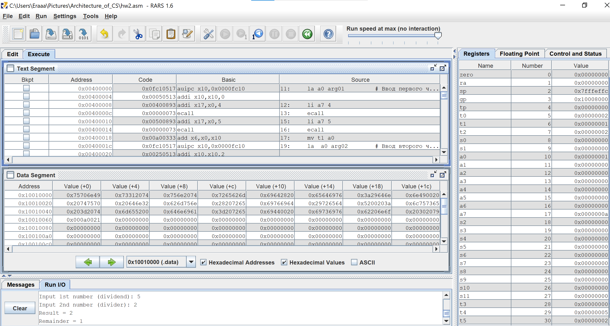
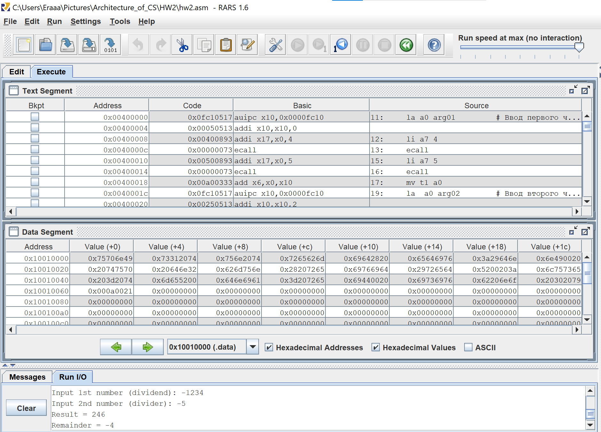
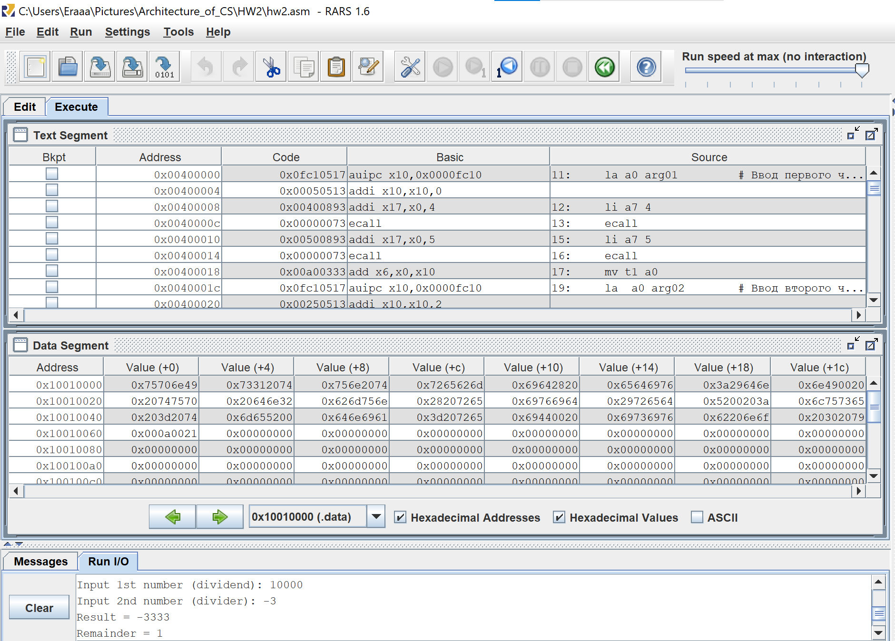
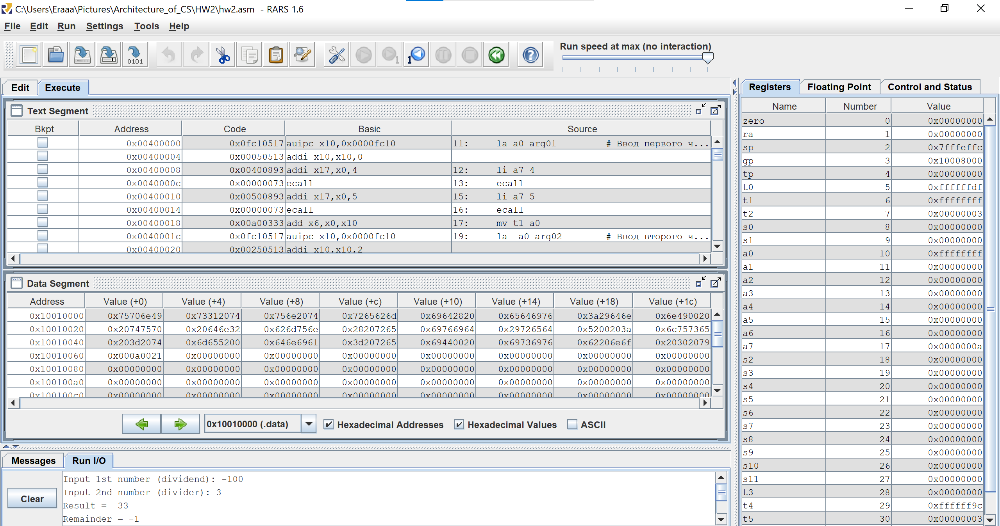
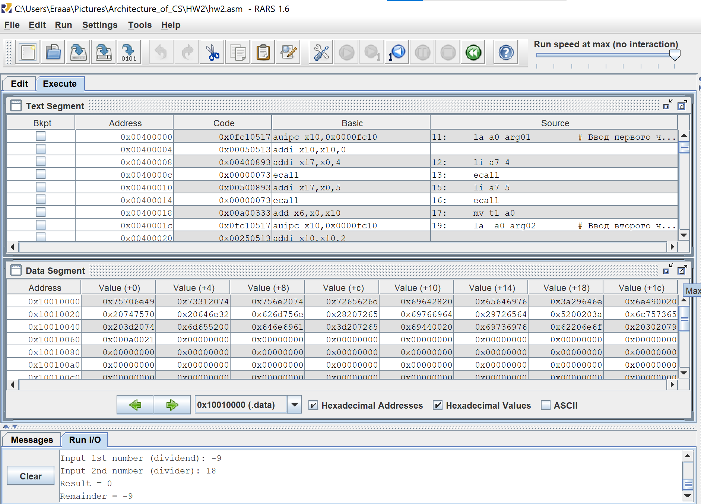
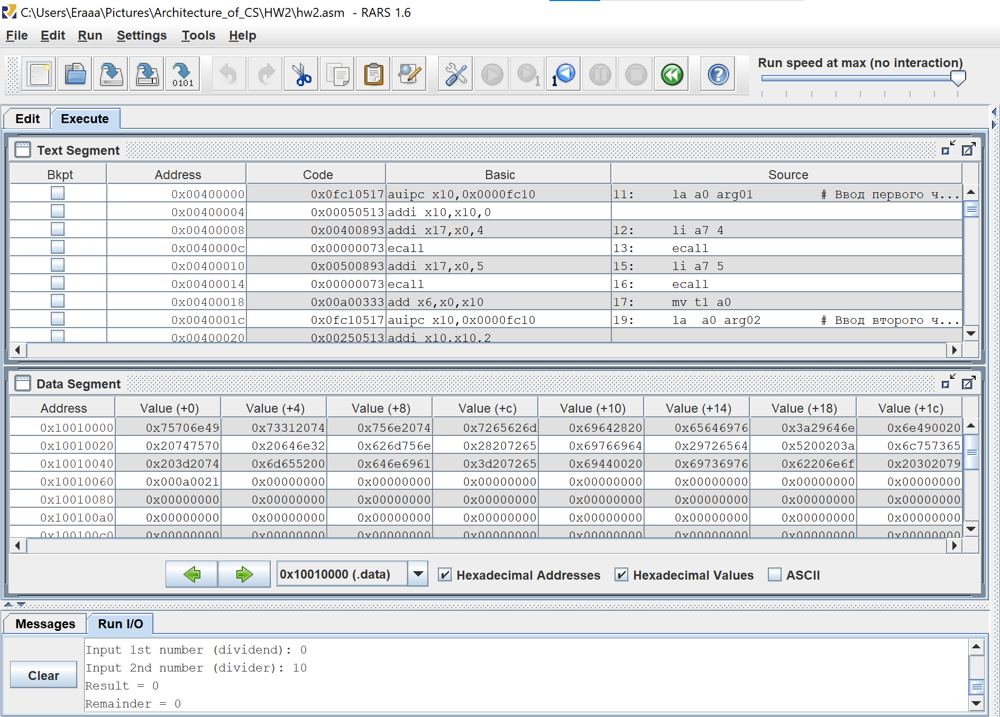
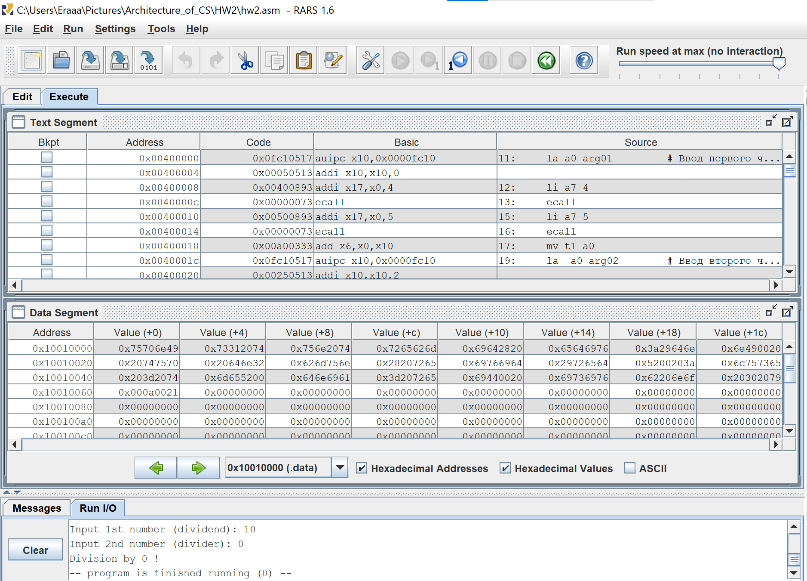
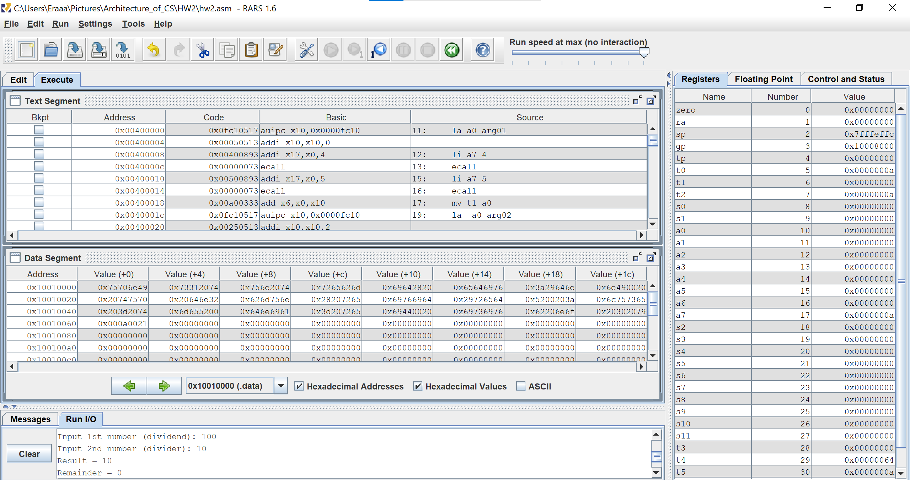

# Отчет

1. Cлучай, когда делимое и делитель положительные:
 

2. Cлучай, когда делимое и делитель отрицательные :

3. Cлучай, когда делимое положительное и делитель отрицательный:

4. Cлучай, когда делимое и делитель положительные:

5. Делимое меньше делителя по модулю (+ разных знаков):

6. Если делимое 0:

7. Если делитель 0:

8. Если деление нацело:

