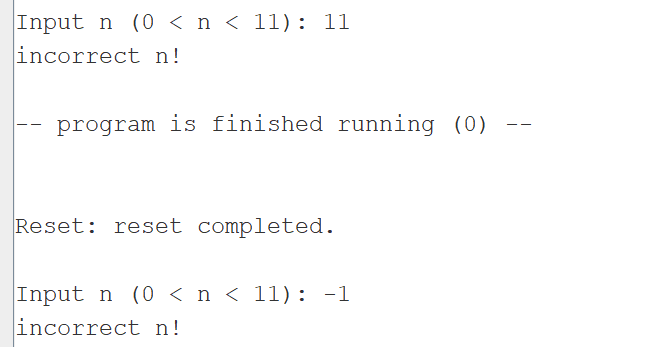

# Отчёт

Необходимые функции (ввода, вывода, суммы) обернуты соответсвующим макросами и находятся в отдельном файле macrolib.s. Функции без использовования собственных макросов расложены в файлах input.asm, ouput.asm, sum.asm, их применение реализовано в программе папки /without macro

## Тесты:

