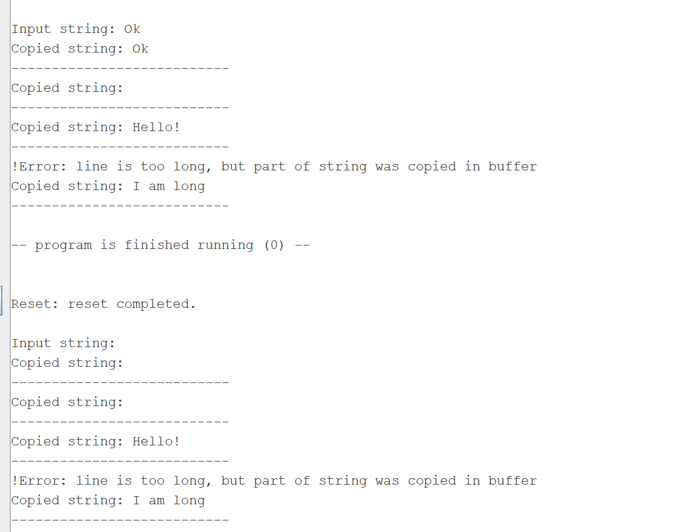
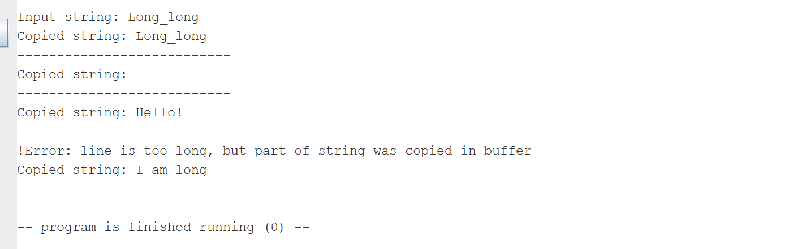

# Отчёт

Программа производит ввод строки не более 10 символов с консоли, далее выводит скопированную строку.

## Тесты:
1. ввод с консоли "Ok\n"

2. ввод с консоли "\n"

3. Ввод с консоли "Long_long" -- попытка ввести строку более 9 символов, не включая \0, естественно невозможна, но тест кореектен, так 
как при копировании последний символ становится \0 в случае переполнения

 

 