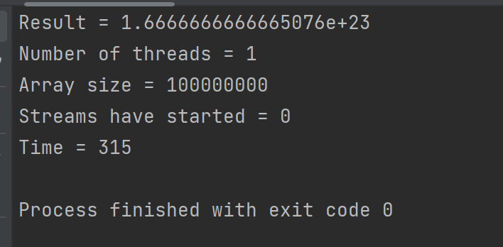
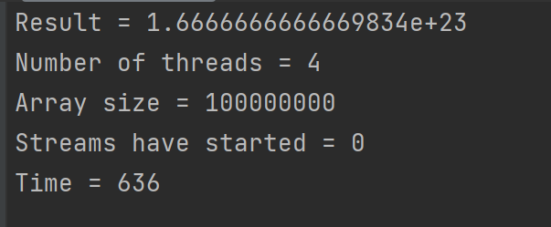
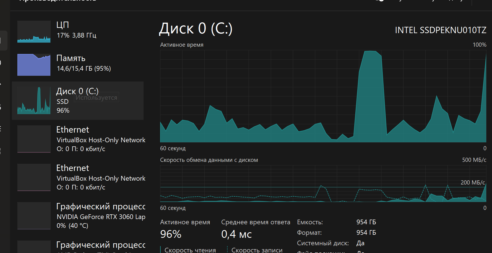
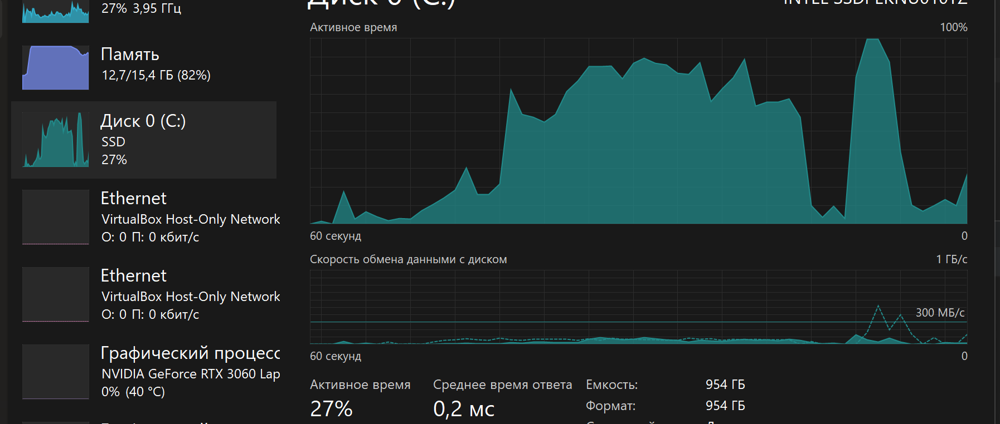
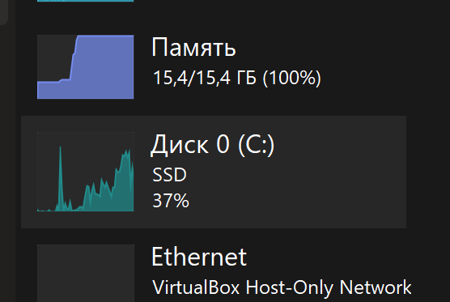
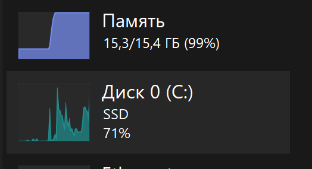

# Отчет

| Число элементов | Число потоков | Время исполнения |
|-----------------|---------------|------------------|
| 100000000       | 1             | 315              |
| 100000000       | 2             | 172              |
| 100000000       | 4             | 636              |
| 100000000       | 8             | 722              |
| 100000000       | 1000          | 722              |
| 500000000       | 1             | 1465             |
| 500000000       | 2             | 3075             |
| 500000000       | 4             | 2122             |
| 500000000       | 8             | 1783             |
| 500000000       | 1000          | 5922             |
| 100000000000    | 1             | 81933            |
| 100000000000    | 2             | 87295            |
| 100000000000    | 4             | 84328            |
| 100000000000    | 8             | 87652            |
| 100000000000    | 1000          | 119583           |

Свопинг при 1 потоке на 100000000000 элементах:

Свопинг при 2х потоках на 100000000000 элементах:

Свопинг при 4 потоках на 100000000000 элементах:

Свопинг при 8 потоках на 100000000000 элементах:

Свопинг при 1000 потоках на 100000000000 элементах:

Свопинг возникает при любом количестве потоков при работе с 100000000000 элементами в обоих векторах. На меньшем количестве
подкачка не происходит. Свопинг во всех случаях происходит практически сразу после запуска программы и переполнения памяти ОЗУ.
Но с разной степенью и достаточно скачкообразно. 
